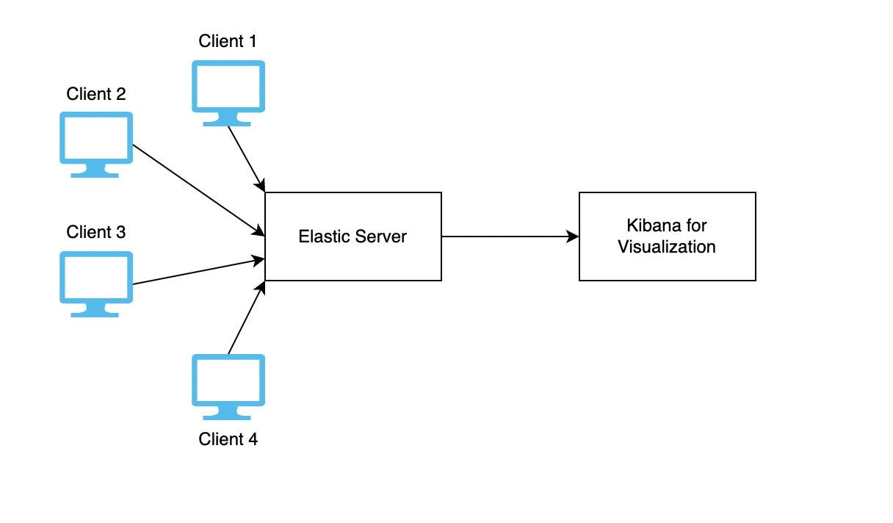

# 🖥 AMATSA
[](https://github.com/VSangarya/AMATSA/actions/workflows/build.yml)
[](https://github.com/VSangarya/AMATSA/releases)
[](https://www.codacy.com/gh/VSangarya/AMATSA/dashboard?utm_source=github.com&utm_medium=referral&utm_content=VSangarya/AMATSA&utm_campaign=Badge_Coverage)
[](https://www.codacy.com/gh/VSangarya/AMATSA/dashboard?utm_source=github.com&amp;utm_medium=referral&amp;utm_content=VSangarya/AMATSA&amp;utm_campaign=Badge_Grade)
[](https://github.com/VSangarya/AMATSA/pulse)
[](https://github.com/VSangarya/AMATSA/issues)
[](https://github.com/VSangarya/AMATSA/graphs/contributors)
[](LICENSE)

[](src)
[](CODE-OF-CONDUCT.md)
[](https://github.com/VSangarya/AMATSA/)

Have you ever reported to your organization's IT team that your machine is slow or running out of disk space? Well, I guess most of us have done this at some point. What if your IT team can be proactive and give you a new disk (or a new asset to meet your workload!) before you even go to them?

Asset Monitoring and Analytics Tool for sysadmins (we call it AMATSA) is a client-based solution for system administrators to monitor assets in their organization. amatsa-client is cross-platform (Linux, Windows, macOS), can be installed on a server/user PC and takes less than 50MB of disk space at runtime. Once you install the amatsa-client on a host, it will periodically send system metrics (asset info, cpu/memory utilization, network etc.) to the backend server. The backend server runs on Elasticsearch and can be hosted on-premise or in the cloud. Sysadmins can then import our [pre-built](data/kibana/dashboard.ndjson) Kibana dashboard or build custom visualization on top of raw data sent by the clients. The meta data on fields listed [here](data/metrics.json) can be used to create custom visualization dashboards.  

## Setting up AMASTA on a PC and exploring the visualization dashboard

https://user-images.githubusercontent.com/68890508/194654605-f23bc6a3-13ba-43b3-b41a-8d8b9015c583.mp4

## 📖 Usecases
*  Gather asset information - how many assets are there in the organization, specification of each asset etc.
*  Monitor assets that haven't rebooted in a while to apply security patches.
*  Monitor assets that have high CPU/memory utilization over time.
*  Monitor assets running out of disk space.
*  Monitor network speed of assets across the organization.

## Workflow and 'How to Do Stuff'
* The architecure of the system is shown below:

  * The script installed at the client side collects client metrics and at fixed intervals and pushes these metrics as a JSON to the elastic server.
  * Kibana is connected to the Elastic Server from where it fetches the data and renders this data in the dashboards accessible by system administrators.
  * This update happens in realtime.

* To use the system: 

  * Follow the steps in [Installation](README.md#🛠-installation).

  * Adding new metrics:
      * You can make changes to the classes in the 'src' directory to track additional metrics or   remove metrics that are currently tracked.
      * Leverage Kibana's convenient UI to create new dashboards as per your requirements.

  * View dashboards:
      * Access your AWS server using your browser.
      * Enter your Kibana credentials to view the dashboards.

## 🛠 Installation
*  See [server installation](INSTALL.md#-server) instructions to setup Elasticsearch and Kibana.
*  See [client installation](INSTALL.md#-client) instructions to deploy amatsa-client on assets.
*  Once the server and the clients are setup, you can import and explore our pre-built Kibana dashboards.
*  Common issues faced by users while setting up client are listed [here](INSTALL.md#debugging).

## 👩🏼‍💻 🚀 Developer Environment Setup
### Prerequisites
1. Python 3.10+
2. VS Code (to make collaboration easier. We don't want to argue over tabs vs spaces!)
### Setup
1. Spawn terminal and change working directory to repo directory.

2. Create virtual environment using venv: `path/to/python -m venv .venv`

3. Activate virtual environment:<br/>
Linux/MacOS:  `source .venv/bin/activate`<br/>
Windows:  `.venv/Scripts/activate`<br/>

4. Install Python dependencies
```Text
pip install -r requirements.txt
pip install -e .
```

## ↑ Enhancements
### Server
*  Send emails to users based on occurrence of an event.

### Client
*  Collect running process information (name, pid) to identify unique instances across your organization.
*  Monitor listening ports across assets to identify which services are listening in your network.
*  Configure a rule file containing filenames to monitor on the client. If the hash of monitored file changes, you can send an event.

### ⚙︎📧 Troubleshooting, help and contact information
For any help or assistance regarding the software, please E-mail any of the developers with the query or a detailed description. Additionally, please use issues on GitHub for any software related issues, bugs or questions.
*  mquresh@ncsu.edu
*  apandit3@ncsu.edu
*  apandit3@ncsu.edu
*  vnagara3@ncsu.edu
*  lsangar@ncsu.edu


